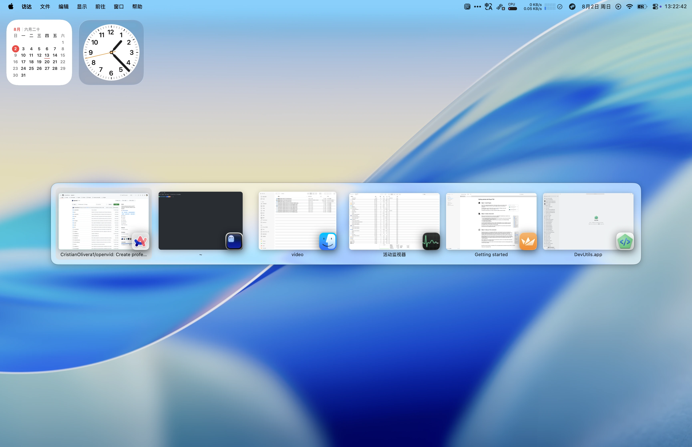
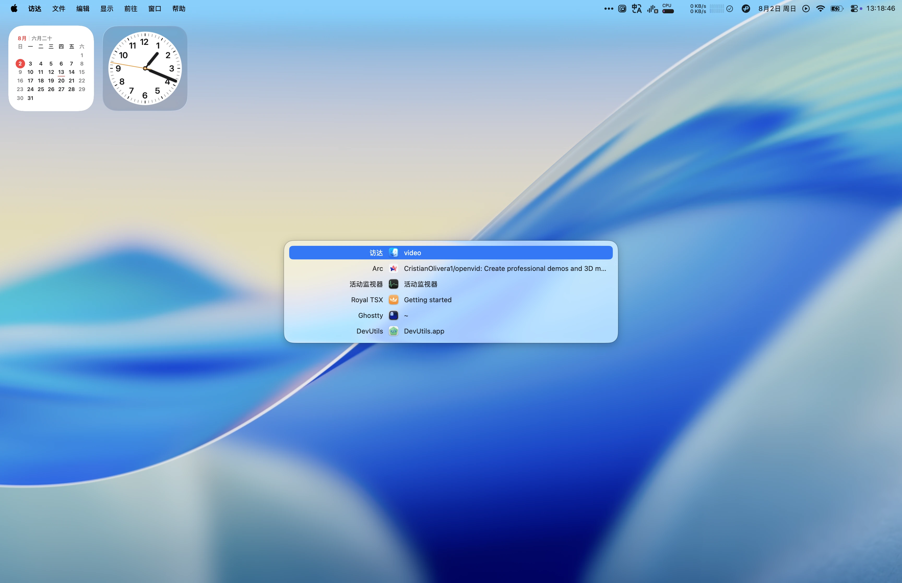

# FlowPane

> Flow between your windows.

FlowPane is a simple, fast, elegant window switcher for macOS. It puts every open window into a compact list or a visual preview grid, so the window you need is always close at hand.

[简体中文](README.zh-CN.md) · [Website](https://metacodes.github.io/FlowPane-Web/) · [Download latest release](https://github.com/metacodes/FlowPane-Web/releases/latest) · [All releases](https://github.com/metacodes/FlowPane-Web/releases)

## Highlights

### Compact List

Scan every window by title and app icon. Compact List keeps the information dense and keyboard-friendly without taking over your desktop.

### Preview Grid

When recognition matters, open Preview Grid. Thumbnails are created locally, making it easy to pick the right window from several similar ones.

### Three ways in

| Shortcut | Mode |
| --- | --- |
| <kbd>⌘ Tab</kbd> | Compact List |
| <kbd>⌥ Tab</kbd> | Preview Grid |
| <kbd>⌘</kbd> + backtick | Windows in the current app |

Choose the rhythm that fits the task: confirm a title quickly, or recognize the window by sight.

### Clear permission boundaries

FlowPane asks only for the macOS permissions needed by the experience you choose:

- Accessibility is used to focus and raise the real window you select.
- Screen Recording is used to create Preview Grid thumbnails locally.
- Window previews are not uploaded, and Compact List works without Screen Recording.

## Requirements

- macOS 14 or later
- Apple Silicon or Intel Mac

## Download and updates

- [Download the latest DMG or ZIP](https://github.com/metacodes/FlowPane-Web/releases/latest)
- [Browse all releases](https://github.com/metacodes/FlowPane-Web/releases)
- [Sparkle update feed](https://metacodes.github.io/FlowPane-Web/appcast.xml)

## Privacy

FlowPane is a local-first macOS utility. Window previews are processed on your Mac. The website uses no analytics, advertising, cookies, accounts, or remote localization.

Read the full [privacy statement](https://metacodes.github.io/FlowPane-Web/privacy.html).

## About this repository

This repository contains the FlowPane product website and public release downloads. It does not contain the FlowPane application source code. FlowPane is proprietary software, and DMG/ZIP builds are published through GitHub Releases.

## License

The FlowPane application, brand, icons, and product assets are proprietary. Unless otherwise stated, website content in this repository is provided for presenting FlowPane and does not grant permission to redistribute the application or its assets.
